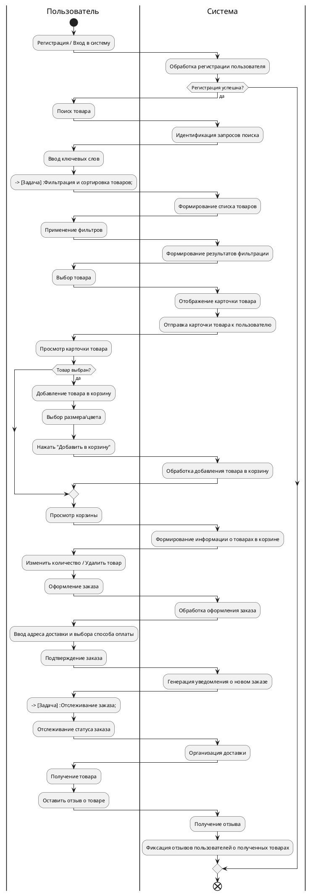

## Диаграмма 2

```plantuml
@startuml
|Пользователь|
start
|Пользователь|
:Регистрация / Вход в систему;
|Система|
:Обработка регистрации пользователя;

if (Регистрация успешна?) then (да)
|Пользователь|
:Поиск товара;
|Система|
:Идентификация запросов поиска;
|Пользователь|
    :Ввод ключевых слов;
    --> [Задача] :Фильтрация и сортировка товаров;
|Система|
:Формирование списка товаров;
|Пользователь|
    :Применение фильтров;
|Система|
:Формирование результатов фильтрации;
|Пользователь|
    :Выбор товара;
|Система|
:Отображение карточки товара;
:Отправка карточки товара к пользователю;
|Пользователь|
    :Просмотр карточки товара;
    if (Товар выбран?) then (да)
        :Добавление товара в корзину;
        :Выбор размера/цвета;
        :Нажать "Добавить в корзину";
|Система|
:Обработка добавления товара в корзину;
|Пользователь|
    endif
    :Просмотр корзины;
|Система|
:Формирование информации о товарах в корзине;
|Пользователь|
    :Изменить количество / Удалить товар;
    :Оформление заказа;
|Система|
:Обработка оформления заказа;
|Пользователь|
    :Ввод адреса доставки и выбора способа оплаты;
    :Подтверждение заказа;
|Система|
:Генерация уведомления о новом заказе;
|Пользователь|
    --> [Задача] :Отслеживание заказа;
    :Отслеживание статуса заказа;
|Система|
:Организация доставки;
|Пользователь|
    :Получение товара;
    :Оставить отзыв о товаре;
|Система|
:Получение отзыва;
:Фиксация отзывов пользователей о полученных товарах;
endif
end
@enduml


```

