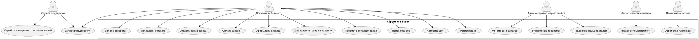

## Диаграмма 1

```plantuml
@startuml
skinparam actorStyle awesome

actor "Покупатель (Клиент)" as Customer
actor "Администратор маркетплейса" as Admin
actor "Логистическая команда" as Logistics
actor "Платежная система" as PaymentSystem
actor "Служба поддержки" as Support

usecase "Запрос в поддержку"
usecase "Отработка запросов от пользователей"

rectangle "Сервис WB Buyer" {
    Customer --> (Регистрация)
    Customer --> (Авторизация)
    Customer --> (Поиск товаров)
    Customer --> (Просмотр деталей товара)
    Customer --> (Добавление товара в корзину)
    Customer --> (Оформление заказа)
    Customer --> (Оплата заказа)
    Customer --> (Отслеживание заказа)
    Customer --> (Оставление отзыва)
    Customer --> (Запрос возврата)
    Customer --> (Запрос в поддержку) 
   
    
    Admin --> (Управление товарами)
    Admin --> (Мониторинг заказов)
    Admin --> (Поддержка пользователей)
    
    Logistics --> (Управление логистикой)
    
    PaymentSystem --> (Обработка платежей)

    Support --> (Отработка запросов от пользователей)
    Support --> (Запрос в поддержку)

}


```